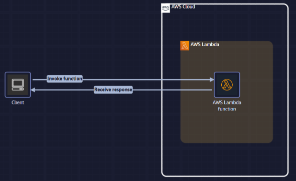
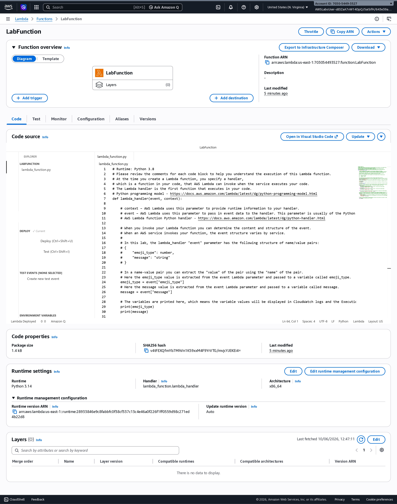
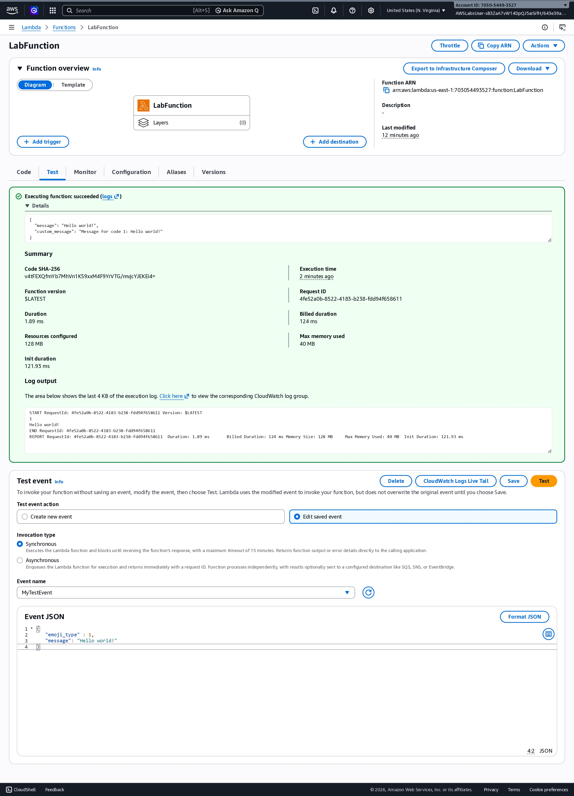
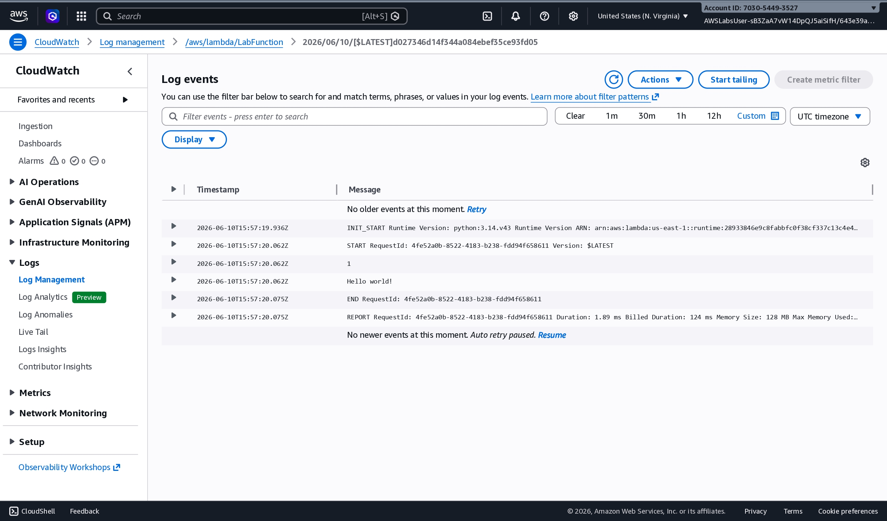

# AWS Serverless Foundations Lab

## Overview

This project demonstrates the implementation of a serverless application using AWS Lambda and Python to process visitor feedback in real time, providing a scalable and cost-effective cloud solution.

## Objective

Build a serverless solution capable of processing customer feedback without provisioning or managing servers.

## Technologies

- Python
- AWS Lambda
- IAM
- Amazon CloudWatch
- Serverless Architecture

## Architecture

## Solution Flow

1. Client sends feedback.
2. AWS Lambda receives the request.
3. Business logic processes the feedback.
4. Lambda returns a response.
5. CloudWatch stores execution logs.

## Skills Demonstrated

- Serverless Computing
- AWS Lambda
- Python
- Event Processing
- Cloud Monitoring

## Screenshots

### Lambda Function

AWS Lambda function successfully deployed and configured.

### Lambda Test Execution

Lambda function executed successfully using a test event.

### CloudWatch Log Events

CloudWatch logs generated during Lambda execution.

## Project Outcomes

- Successfully deployed an AWS Lambda function
- Processed events through synchronous invocation
- Validated execution using test events
- Monitored execution through Amazon CloudWatch Logs

## Lessons Learned

- Understanding AWS Lambda execution model
- Synchronous invocation
- Automatic scaling
- Pay-per-use architecture

## Future Improvements

- Upload Lambda source code
- Add additional test scenarios
- Implement error handling and validation
- Integrate with API Gateway

## Project Information

- Platform: AWS Skill Builder
- Lab: Serverless Foundations
- Completion Date: June 2026

## Author

**Ze Mendes**  
Cloud & Security Professional
